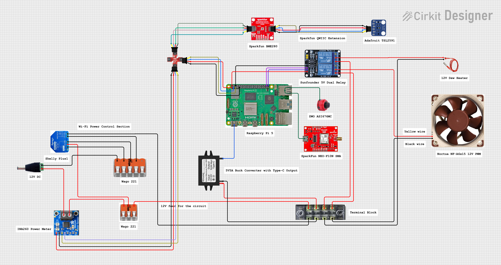

# AllSky INA260 Module

|   |   |
| ------------ | ------------ |
| **Status**  | Experimental  |
| **Level**  | Intermediate  |
| **Runs In**  | Periodic |

A module to read voltage, current, and power from an INA260 sensor.

## Description

This module interfaces with a Texas Instruments INA260 current/voltage/power monitor over I2C. The INA260 is a high-precision sensor that measures:
- **Voltage** (Bus voltage in Volts)
- **Current** (Current in Amps, can be positive or negative)
- **Power** (Power in Watts)

These sensors can be useful for monitoring power consumption of various components in your AllSky setup, such as:
- Dew heaters
- Fan power consumption
- Battery charging/discharging

## Configuration

### Parameters

- **I2C Address** (default: `0x40`): The I2C address of the INA260 sensor. The default address is 0x40, but this can be changed via hardware configuration on some breakout boards.
- **I2C Bus** (default: `1`): The I2C bus number. On most Raspberry Pi models, this is bus 1.
- **Sensor Name** (default: `INA260`): A custom name prefix for the overlay variables. This allows you to distinguish between multiple sensors (e.g., "HEATER", "CAMERA").
- **Extra Data Filename** (default: `allskyina260.json`): The JSON file where sensor data will be saved for use in overlays.

### Overlay Variables

The module creates the following variables in the extra data file:

- `AS_<SENSORNAME>VOLTAGE` - Bus voltage in Volts
- `AS_<SENSORNAME>CURRENT` - Current in Amps (positive for consumption, negative for charging)
- `AS_<SENSORNAME>POWER` - Power in Watts
- `AS_<SENSORNAME>TIME` - Timestamp of the reading

For example, with the default sensor name "INA260":
- `AS_INA260VOLTAGE`
- `AS_INA260CURRENT`
- `AS_INA260POWER`
- `AS_INA260TIME`

## Hardware Setup



1. Connect the INA260 sensor to your Raspberry Pi's I2C bus:
   - VCC to 3.3V or 5V
   - GND to Ground
   - SDA to GPIO 2 (SDA)
   - SCL to GPIO 3 (SCL)

2. Connect the power supply you want to monitor to the INA260's IN+ and IN- terminals.

3. Ensure I2C is enabled on your Raspberry Pi:
   ```bash
   sudo raspi-config
   # Navigate to Interface Options -> I2C -> Enable
   ```

4. Verify the sensor is detected:
   ```bash
   sudo i2cdetect -y 1
   ```
   You should see your sensor at address 0x40 (or your configured address).

## Installation

The module will automatically install its required dependency (`smbus2`) when installed through the AllSky module installer.

## Usage Example

Use the overlay variables in your AllSky overlay configuration to display power metrics:

```
Power: {AS_INA260POWER}W
Voltage: {AS_INA260VOLTAGE}V
Current: {AS_INA260CURRENT}A
```

## Notes

- Current readings can be negative, indicating power flowing in the opposite direction (e.g., battery charging) or the terminals could have been wired in reverse.
- Ensure your power supply is within the INA260's specifications (0-36V, ±15A)

## Troubleshooting

**Sensor not detected:**
- Verify I2C connections
- Check if I2C is enabled (`sudo i2cdetect -y 1`)
- Verify the I2C address matches your hardware configuration

**Incorrect readings:**
- Ensure the sensor is properly connected to the power circuit
- Check that IN+ and IN- are connected correctly (positive and negative terminals)
- Verify the sensor's datasheet for proper shunt resistor configuration

## Version History

- **v1.0.0** - Initial release
  - Support for voltage, current, and power monitoring
  - Configurable I2C address and bus
  - Configurable sensor naming for multiple sensor support
