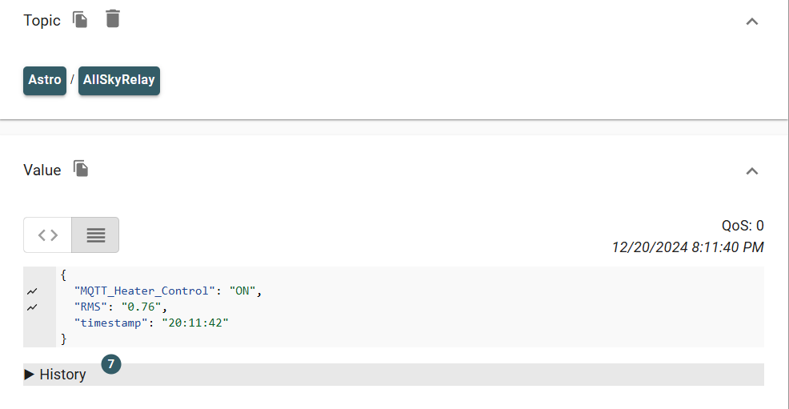

# Get Messages From MQTT Module

|             |                      |
|-------------|----------------------|
| **Status**  | Experimental         |
| **Level**   | Beginner             |
| **Runs In** | Periodic |

This module subscribes to a specified MQTT topic that contains a JSON object and makes the 'Keys' available as variables in the Overlay Editor.


The module contains the following options:

| Setting              | Description                      |Required or Optional |Default Value
|----------------------|----------------------------------|---------------------|-----------
| mqttserver           | MQTT Server name or IP address   |Required             |-
| mqttport             | MQTT Port (usually 1883)         |Optional             |1883
| mqtttopic            | MQTT topic to subscribe to       |Required             |-
| mqttusername         | Username for MQTT broker         |Optional             |-
| mqttpassword         | Password for MQTT broker         |Optional             |-
| extradatafilename    | Name to use for extradata file   |Optional             |allskymqttsubscribe.json
| period               | Update frequency                 |Optional             |60 seconds
| Prefix               | 

NOTE: Set retain flag for your MQTT messages. Otherwise the client may miss the message if data gets published while the script is waiting for the next run.
 
<!-- these images don't exist
## Allsky Overlay (the values to the top right with 'MQTT' in the name)


## Example output 
MQTT Topic data on Mmosquitto as seen using MQTT Explorer:


-->
## Example output 

JSON from MQTT topic saved to `~allsky/tmp/extra/allskymqttsubscribe.json`:

```json
{
    "MQTT_Heater_Control": "ON",
    "RMS": "0.76",
    "timestamp": "20:11:42"
}
```

Log output from `/var/log/allskyperiodic.log` with DEBUG level set to `4` in Allsky settings:

```shell
2024-12-20T20:15:10.014662-06:00 allskypi5 allskperiodic[116931]: INFO: --------------- Running Module allsky_mqttsubscribe ---------------
2024-12-20T20:15:10.014678-06:00 allskypi5 allskperiodic[116931]: INFO: Connected to MQTT server 192.168.1.250:1883
2024-12-20T20:15:10.014697-06:00 allskypi5 allskperiodic[116931]: INFO: Received message: {
2024-12-20T20:15:10.014717-06:00 allskypi5 allskperiodic[116931]:   "MQTT_Heater_Control": "ON",
2024-12-20T20:15:10.014733-06:00 allskypi5 allskperiodic[116931]:   "RMS": "0.76",
2024-12-20T20:15:10.014752-06:00 allskypi5 allskperiodic[116931]:   "timestamp": "20:11:42"
2024-12-20T20:15:10.014766-06:00 allskypi5 allskperiodic[116931]: }
2024-12-20T20:15:10.014780-06:00 allskypi5 allskperiodic[116931]: INFO: Final result: {'MQTT_Heater_Control': 'ON', 'RMS': '0.76', 'timestamp': '20:11:42'}
```

JSON payload can also be nested:

```json
{
  "name": "Heater",
  "gpio": 21,
  "properties": {
    "direction": "out",
    "state": "off"
  }
}
```

in which case, root keys are appended as suffixes to the child keys (in this case, `properties` is appended).
