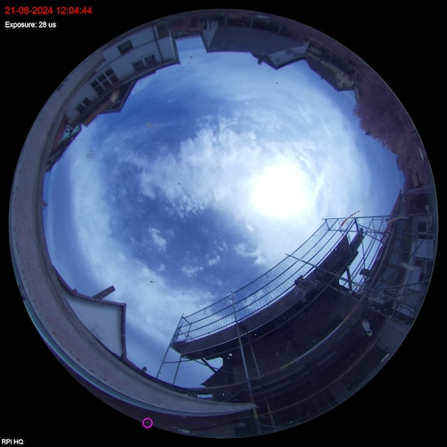

# AllSky telescope marker module
This module will mark the current position of your telescope in AllSky images. Each time the module starts it will refresh the current telescope postion allowing to track your observing conditions in real time.

It does require ASCOM Remote Server with a connected telescope to retrieve the alt/az from
If you wish to test you can setup a simulated ASCOM telescope in the remote server or define a fallback location for your telescope (ASCOM Remote Server not accessible or response is not a valid JSON object).

For details how to setup ASCOM Remote server and API documenation see:
[ASCOM Remote Server](https://download.ascom-standards.org/docs/RemoteInstConf.pdf)
[ASCOM Alpaca Device API](https://ascom-standards.org/api/#/Telescope%20Specific%20Methods)

The minimum requirements to get it working are:
* You are using a fisheye lense with at least 180° FOV
* The AllSky image is square (cropped)

In the module settings the are configuration options for:
* Define individual long/lat/altitude for telescope and AllSky camera
* Set azimuth rotation if your sensor is not pointing north
* Customzize size/color of the marker
* Define x,y coordinate flip to map image orientation

### Release info
### V0.1
* Initial release developed based on AllSky v2023.05.01_04 and ASCOM Remote Server v6.7.1
